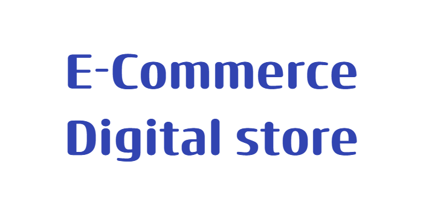
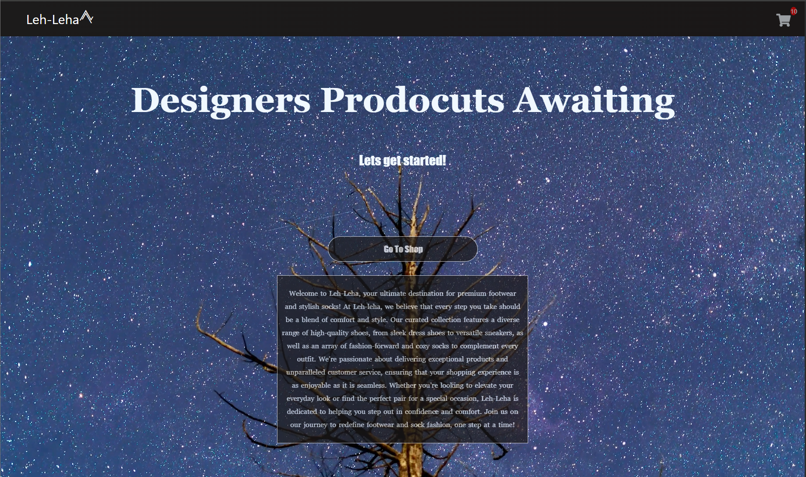
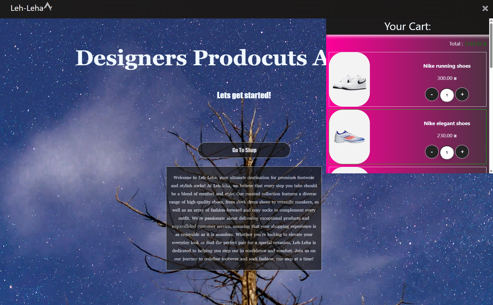
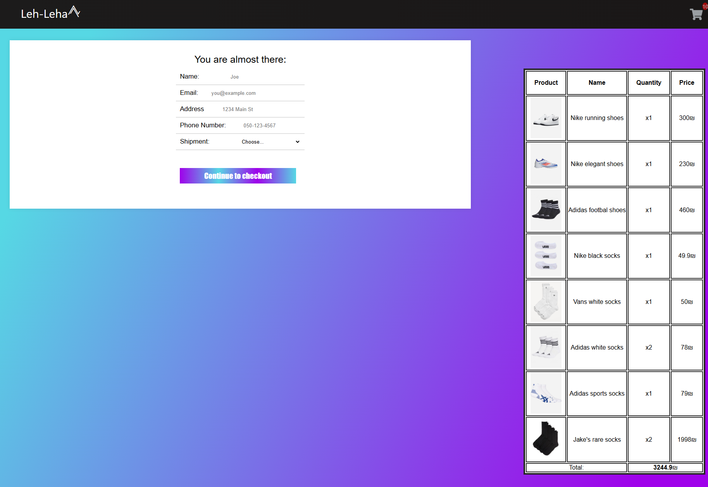

<p align="center">
  
</p>

--- 


<p align="center">
  
  
  
  
  

</p>

---

## **🌐Overview** 

<p>React-based e-commerce digital store featuring a dynamic product catalog, cart management, and seamless user experience.</p>


---

## 📝Description

A **React-based** e-commerce web application featuring a Home page, a Shop page with a dynamic product catalog, a shopping cart, and a checkout page. The interface is fully responsive, providing a smooth shopping experience across devices. Users can browse products, add items to the cart, and simulate checkout. The project showcases component-based architecture, **state management** with **React hooks**, and integration of a simple frontend-only e-commerce workflow.


The backend is powered by **Node.js** and Express, providing a lightweight server to serve data and handle interactions. **MongoDB** is used as a database to store product information, enabling easy retrieval and dynamic rendering of the catalog. The application also incorporates CSS for styling and layout, ensuring a visually appealing and consistent user experience across devices.

---

## 🧩General Structure:

**Client:**
- Modern and responsive web interface built with **React**.
- Dynamic display of products and categories.
- Interactive shopping cart with real-time price updates.

**Server:**
- API built with **Node.js** and **Express**.
- Handles product and order data stored in **MongoDB**.
- Processes requests from the client for product retrieval and cart operations.


**Folder Structure Highlights:**
- `client/` – React frontend, UI components and pages.
- `server/` – Node.js/Express backend and API endpoints.

---

## 🖼️ Screenshots

Here is a preview of the Website:

<p align="center">
  
</p>

<p align="center">
  
  
</p>

<p align="center">
  
  
</p>

---

## 🚀 Deployment  

The application is fully deployed and can be accessed online at [**E-Commerce Store**](https://e-commerce-store-front.onrender.com). The frontend is hosted on **Render** and communicates securely with the backend API. During deployment, environment variables were used to safely manage sensitive information like database connection strings. The deployment process involved building the React frontend, setting up the Node.js/Express backend, and configuring **CORS** to allow the frontend to fetch data from the backend. This live deployment provides a real-world demonstration of the project’s functionality, allowing users to browse products, manage their cart, and simulate checkout in a production environment.

---

## 💡Getting Started
Follow these steps to run the project locally:

**Prerequisites**

* Node.js (v14 or higher recommended)

* npm (comes with Node.js) or yarn

**Installation & Running**

  1.Clone the repository
```
git clone https://github.com/Kfir989/WebDev_Ecommerce_Website.git
cd WebDev_Ecommerce_Website
```

  2.Start backend server
    
```
cd server
npm install
npm run dev
``` 

  2.A.Create the MongoDB collection
    

    1.Log in to your MongoDB Atlas account (or your local MongoDB instance).

    2.Create a database (shop).

    3.Inside that database, create a collection (products).

    4.Import the initial product list:

    The repository contains a file (productlist.js) with sample product data.

 

  3.Start the frontend
```
cd client
npm install
npm start
```   
  4.Open in browser
  Visit http://localhost:3000 to view the running application.

  ---

## ✨ Features

🏠 **Home Page** – Welcoming landing page

🛒 **Shop Page** – Browse products dynamically

🛍️ **Shopping Cart** – Add, remove, and update quantities

💳 **Checkout Page** – Simulate purchases and view order summary

📱 **Responsive Design** – Works on desktop, tablet, and mobile

⚛️ **Component-Based Architecture** – Modular React components

🔄 **State Management with React Hooks** – Real-time updates for cart and catalog

---

## 🛠️Technologies

* React – Frontend.

* Node.js & Express – Backend.

* MongoDB – database.

* Git & GitHub – project hosting for collaboration and code management.

---
